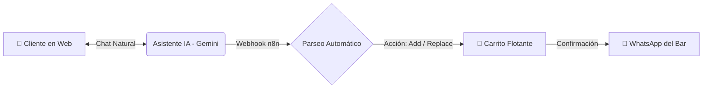

<div align="center">

# 🍲 Café Bar Titi
### Tradición sevillana y sabor de ribera en cada detalle desde 1968

[](https://nextjs.org/)
[](https://react.dev/)
[](https://tailwindcss.com/)
[](https://ai.google.dev/)
[](https://n8n.io/)
[](https://firebase.google.com/)

---

</div>

Esta es la aplicación web oficial y plataforma de pedidos inteligentes de **Café Bar Titi**, un emblemático establecimiento de Coria del Río (Sevilla) fundado en 1968. La plataforma combina la rica tradición gastronómica andaluza con tecnología de vanguardia, ofreciendo una experiencia de usuario premium, un agente de Inteligencia Artificial para pedidos automatizados y un rendimiento excepcional en móviles y escritorio.

---

## 🤖 ✨ Asistente Virtual IA & Gestión de Pedidos

La gran innovación de la web es su **Asistente Virtual IA** integrado (impulsado por **Google Gemini** y orquestado mediante **n8n**), diseñado para actuar como un auténtico camarero sevillano: amable, cercano y altamente eficiente.



* **Conversación Natural y Recomendaciones:** El agente conoce al detalle toda la carta, precios, ingredientes y alérgenos. Puede sugerir maridajes (como una *Manzanilla de Sanlúcar* para el *Pescadito frito*) o explicar en qué consiste la *Carne Mechada de la casa*.
* **Control Inteligente del Carrito (`Add` & `Replace`):** El bot actualiza el carrito de la compra en tiempo real. Si el cliente pide un *Solomillo al whisky* sin especificar tamaño, el bot pregunta primero si lo quiere de *tapa*, *media* o *ración*. Si el cliente cambia de opinión (de tapa a media ración), el sistema reemplaza dinámicamente el ítem sin duplicar productos.
* **Cierre de Pedido por WhatsApp:** Una vez el cliente confirma que no desea nada más, el bot solicita su nombre de pila y genera un enlace directo de WhatsApp con el desglose exacto del pedido, notas de alérgenos y cálculo total, listo para que la cocina del bar lo prepare.

---

## 🚀 Funcionalidades Principales

* 📖 **Carta Digital Interactiva:** Exploración completa por categorías (*Entrantes, Tapas Variadas, Montaditos, Pescado Frito, Carnes a la Brasa, Vinos y Postres*) con filtrado en tiempo real y avisos claros de alérgenos.
* 🍽️ **Reservas Online Intuitivas:** Sistema de solicitud de mesas para agilizar la planificación y garantizar el mejor sitio en el local o la terraza.
* 📸 **Galería Gastronómica:** Un recorrido visual inmersivo por las especialidades del local, con carga diferida (lazy loading) y optimización de formato.
* 📍 **SEO Local de Alta Fidelidad:** Implementación avanzada de microdatos estructurados (`JSON-LD` de tipo `Restaurant`) para dominar las búsquedas locales y Google Maps en Sevilla y el Aljarafe.
* 📱 **Diseño Responsivo "Mobile-First":** Interfaz fluida con botones de acción rápida (llamada directa, apertura del chat IA y carrito flotante) pensada para usarse cómodamente con una sola mano.

---

## 🛠️ Arquitectura Tecnológica

| Componente | Tecnología | Descripción |
| :--- | :--- | :--- |
| **Frontend** | Next.js 15 (App Router), React 19 | Arquitectura moderna con renderizado híbrido y modo `standalone`. |
| **Estilizado** | Tailwind CSS, ShadCN UI | Diseño elegante, accesible, con soporte para modo oscuro y animaciones fluidas. |
| **Motor IA** | Google Gemini (1.5 Flash / Flash-8B) | Razonamiento avanzado para el agente conversacional con cuotas de alto rendimiento. |
| **Orquestación** | n8n Webhooks | Flujo automatizado que conecta el chat web con Gemini y gestiona el estado del pedido. |
| **Backend & BD** | Firebase (Firestore & Auth) | Almacenamiento seguro en la nube y gestión en tiempo real. |

---

## ⚡ Rendimiento y Optimización

* 🎯 **Lighthouse Puntuación Perfecta:** Objetivo de 95+ en Rendimiento y 100 en SEO/Accesibilidad.
* 🖼️ **Optimización de Assets:** Uso intensivo de `next/image` con compresión automática a formatos de nueva generación (WebP/AVIF).
* 🗄️ **Estrategia de Caché:** Preparado para configuraciones avanzadas de Nginx y PM2 en modo clúster para soportar picos de alto tráfico sin inmutarse.

---

## 📦 Configuración y Puesta en Marcha

### 1. Requisitos Previos
* Node.js (v18 o superior)
* Instancia de n8n activa para el webhook del agente IA
* Proyecto de Firebase configurado

### 2. Instalación local

```bash
# 1. Clonar el repositorio
git clone https://github.com/tu-usuario/CafeBarTiti.git
cd CafeBarTiti

# 2. Instalar dependencias
npm install

# 3. Configurar variables de entorno (crear archivo .env.local)
# Añade tus credenciales de NEXT_PUBLIC_FIREBASE_...

# 4. Iniciar el servidor de desarrollo
npm run dev
```

### 3. Construcción para Producción

```bash
npm run build
npm run start
```

---

<div align="center">

**Café Bar Titi** — *Donde la cocina de siempre se une con el futuro.* 🍷
<br>
<sub>© 1968-2026 Café Bar Titi. Todos los derechos reservados.</sub>

</div>
